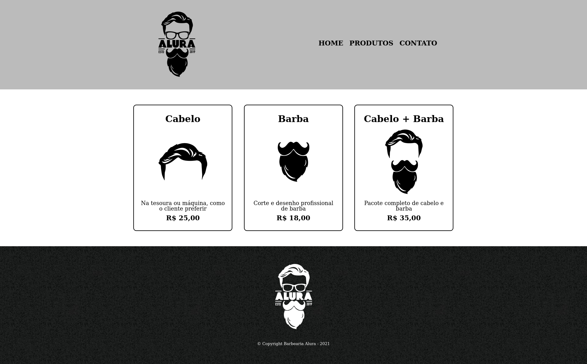

### HTML5 e CSS3 parte 2: Posicionamento, listas e navegação

- Aprenda a estrutura da página HTML
- Navegue entre páginas web
- Conheça reset.css e o posicionamento pelo CSS
- Entenda a diferença entre inline e block
- Lide com bordas e pseudo-classes CSS

### Conteúdos

- Criando uma nova página
  - Introdução
  - Projeto inicial do treinamento
  - Revisão
  - Nova página
  - Estrutura de uma página HTML
  - Download das imagens
  - Novo cabeçalho
  - Logo do site
  - Consolidando o seu conhecimento
  - O que aprendemos?

- Navegação entre páginas
  - Projeto da aula anterior
  - Estruturando a navegação
  - Navegando entre as páginas
  - Arrumando a lista
  - Texto em maiúsculo
  - Consolidando o seu conhecimento
  - O que aprendemos?

- Posicionamento dos elementos
  - Projeto da aula anterior
  - Download do reset.css
  - Limpando o CSS
  - Como deixar o CSS limpo
  - Como funciona o posicionamento
  - Posicionamento
  - Posicionando o cabeçalho
  - Centralizar elementos
  - Consolidando o seu conhecimento
  - O que aprendemos?

- A tag section
  - Projeto da aula anterior
  - Divisões semânticas
  - Por que usar as tags semânticas?
  - Criando listas complexas
  - Itens de lista
  - Reforçando o inline-block
  - Comportamentos de blocos
  - Ajustando o tamanho dos elementos
  - Espaçamento interno
  - Consolidando o seu conhecimento
  - O que aprendemos?

- Lidando com bordas
  - Projeto da aula anterior
  - Aplicando bordas
  - Funcionamento das bordas
  - Bordas arredondadas
  - CSS para os cantos arredondados
  - Consolidando o seu conhecimento
  - O que aprendemos?

- Pseudo-classes CSS
  - Projeto da aula anterior
  - Pseudo-classes de estado
  - Comportamentos dos elementos
  - Aplicando hover e active
  - Comportamento do mouse
  - Consolidando o seu conhecimento
  - O que aprendemos?

- Finalizando a página de produtos
  - Projeto da aula anterior
  - Rodapé
  - Imagem de fundo
  - Caracteres especiais
  - Tipos de caracteres especiais
  - Consolidando o seu conhecimento
  - Projeto do curso
  - O que aprendemos?
  - Conclusão

---

