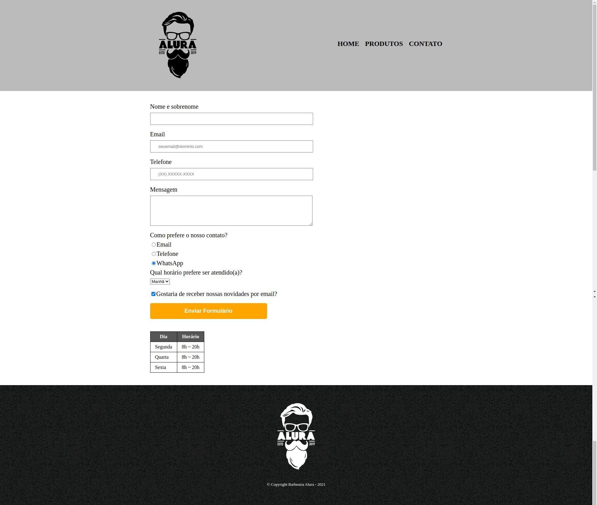

### HTML5 e CSS3 parte 3: Trabalhando com formulários e tabelas

- Crie formulários complexos
- Trabalhe com campos para celulares
- Apresente informações em tabelas
- Use estilos para formulários, campos e tabelas
- Entenda a hierarquia no CSS
- Trabalhe com transformações e transições

- Criando uma nova página
  - Introdução
  - Começando a página de contato
  - Funcionamento de formulários
  - Consolidando o seu conhecimento

- Começando um formulário
  - Campos básicos
  - Estrutura básica
  - Estilos para o formulário
  - Input com espaço entre a borda e o conteúdo
  - Consolidando o seu conhecimento

- Tipos de campos diferentes
  - Formulários mais completos
  - Campos complexos
  - CSS para formulários complexos
  - CSS repetido
  - Hierarquia no CSS
  - Cor final do parágrafo
  - Selecionando opções
  - Selects e options

- Melhorando a semântica
  - Inputs para celulares
  - Celulares e formulários
  - Dados importantes nos inputs
  - Formulários mais fáceis de serem preenchidos
  - Melhorando a semântica do formulário
  - Título de um grupo de campos do formulário

- CSS avançado
  - O que são transições?
  - Transição com duração
  - Entendendo transformações
  - Aumentando proporcionalmente
  - Consolidando o seu conhecimento

- Estrutura de tabelas
  - Tabela básica
  - Criando linhas em uma tabela
  - Tags semânticas para tabelas
  - Como dividir uma tabela
  - Estilos na tabela
  - Para saber mais: Juntando células da tabela
  - Consolidando o seu conhecimento

